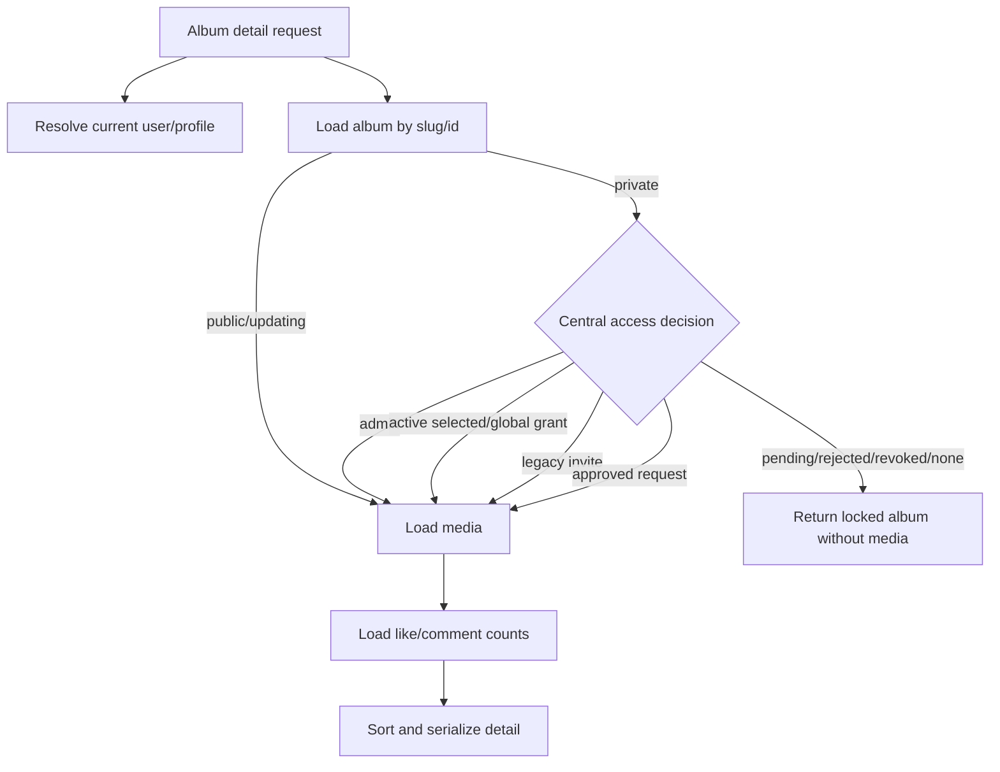
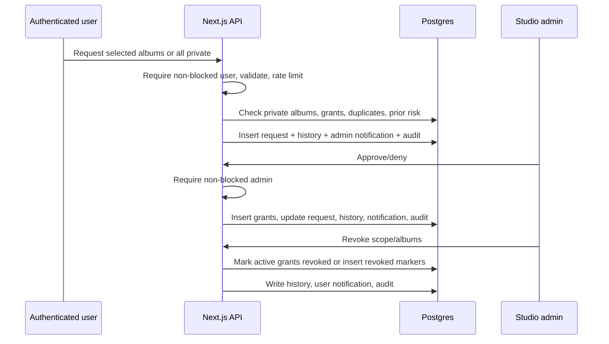
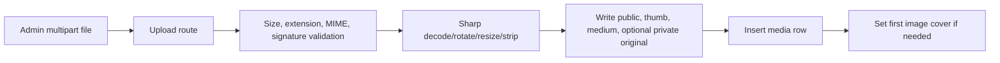
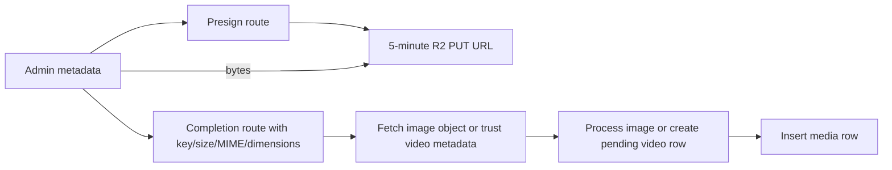
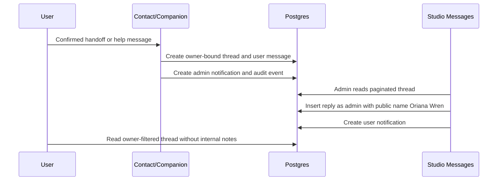

# Data-Flow Map

- Status: COMPLETE
- Milestone: 1
- Audit date: 2026-07-14

## Trust Boundaries

| Boundary | Trusted side | Untrusted or less-trusted side | Current control |
|---|---|---|---|
| Browser to Next.js | Server route/layout/proxy | Browser inputs, cookies, headers, query/body | Zod/route validation, OAuth token verification, Origin check, rate limits |
| Next.js to Supabase Auth | Server | Cookie/bearer tokens | Anon client `auth.getUser`, refresh-token exchange |
| Next.js to Postgres | Server/service role | Route caller and browser-supplied identifiers | Application guards; service role bypasses RLS for most calls |
| Authenticated user to Postgres | Intended RLS boundary | User JWT | RLS exists, but application lacks a general JWT-bound database client |
| Browser to R2 direct upload | Presigned PUT | Browser bytes and completion metadata | Five-minute URL, key/content-type binding, route admin check before issuance |
| Next.js to R2 | R2 credentials | Object key derived from request/data | Server-only SDK; one bucket/client abstraction |
| Public CDN to visitor | Public derivatives | Anyone with URL | Permanent public URLs and immutable cache |
| Private media to authorized visitor | Intended authorization gateway | Unauthorized/blocked/revoked visitor | Not yet a distinct object-level delivery boundary |
| Admin to normal user | Public identity serializer | Founder/admin identity | Help serializer forces `Oriana Wren` and null admin avatar |

## Authentication Flow

```mermaid
sequenceDiagram
  participant B as Browser
  participant N as Next.js
  participant A as Supabase Auth
  participant D as Postgres
  B->>N: POST /api/auth/login or /register with relative next
  N->>N: Validate next and set httpOnly flow cookies
  N->>A: Create Google OAuth URL
  A-->>B: Google/Supabase redirect
  B->>N: GET /auth/callback (code or hash bridge)
  N->>A: Exchange code/session or validate posted tokens
  N->>D: Service-role profile upsert and blocked check
  N-->>B: Secure access/refresh cookies; redirect to next or /boycott
  B->>N: Later protected request
  N->>A: Validate access token or refresh session
  N->>D: Service-role profile sync and blocked check
```

Sensitive data: access token, refresh token, user ID, email, provider profile. Tokens are stored in `httpOnly` cookies after callback. The implicit callback temporarily reads tokens from the URL fragment in browser script, then posts them to `/api/auth/session`.

## Public Album List Flow

```mermaid
flowchart LR
  V[Visitor] --> P[/albums page or API]
  P --> S[Public session resolution]
  P --> A[Service-role albums query]
  A --> M[Service-role media query for eligible album IDs]
  M --> C[Server strips locked private covers/previews]
  C --> V
```

Current characteristics:

- albums are not database-paginated in `getAlbums`;
- preview media is loaded for all eligible album IDs and truncated to four in memory;
- empty/error paths can return sample albums;
- locked private album serialization removes cover and preview items for non-approved users.

## Private Album Detail and Access Decision



The access decision is centralized in `checkPrivateAlbumAccess`, but all database reads use service role. Private media, when authorized, is returned using existing URL columns rather than a dedicated short-lived delivery descriptor.

## Access Request, Approval, and Revocation



Revocation changes future access decisions immediately at the database-read layer. Already-issued permanent public URLs are not invalidated, and no private signed-delivery layer currently exists.

## Image Upload Flow

### Server multipart upload



### Presigned direct upload



The completion route does not currently perform an R2 HEAD/checksum comparison against a server-side upload reservation. Images are fetched and decoded; videos are not independently probed.

## Media Delivery and Download Flow

### Current display

- Public cards and detail viewers select thumbnail/medium/poster/full URL columns in components/helpers.
- Public derivatives are permanent R2 public-origin URLs.
- Authorized private album detail returns the same URL model; no signed GET/gateway boundary exists.
- Locked albums receive no media array from `getAlbum`.

### Single download

```mermaid
flowchart LR
  B[Browser] --> API[/api/media/id/download]
  API --> S[Resolve session and rate limit]
  API --> DB[Load media and album]
  DB --> P{Admin or public-download policy}
  P -->|deny| E[403]
  P -->|allow| F[Fetch stored media URL]
  F --> B
```

The current single-download policy supports admin and public albums. It does not grant normal users a private-album download path even when album access is approved.

### ZIP download

The route loads album detail, checks `download_allowed`, fetches up to 100 image URLs serially, optionally converts each to JPEG with Sharp, creates one outer album folder plus README, and streams a generated ZIP. Generation is request-bound and memory/CPU intensive.

## Help and Notification Flow



User APIs require a session and reject blocked users for writes. The helper enforces a ten-consecutive-message cap. User serialization excludes internal notes and administrator profile identity.

## Studio Data Flow

- Studio layout and APIs require admin/founder sessions.
- Most Studio queries/mutations use service role after application authorization.
- Settings, landing, and About writes revalidate public paths.
- Album/media mutations write audit events; coverage varies by route.
- Direct upload, metadata editing, access workflows, comments, users, analytics, health, and messages are separate route surfaces rather than one transactional DAM pipeline.

## Logging and Rate-Limit Flow

- Proxy in-memory buckets provide coarse per-instance protection.
- `security_rate_limits` provides action-specific database-backed counters keyed by user or browser fingerprint.
- Audit rows include actor, action, target, path, method, IP, user-agent, and caller-provided metadata.
- Proxy audit metadata currently records the raw request search string; signed URLs are not handled by proxy as application routes, but query strings can still contain sensitive application input.
- Database counter increments use read-then-update and are not atomic under concurrency.

## Cache and Privacy Classification

| Data | Current behavior | Required target |
|---|---|---|
| Public album metadata | Dynamic/no-cache | Bounded public cache with revalidation |
| Public derivatives | Permanent URL, immutable cache | Preserve with versioned keys |
| User session/profile | Dynamic | Private/no-store |
| Private album metadata | Dynamic and server-filtered | Private/no-store, minimal locked projection |
| Private media bytes | Same URL model as public media | Private storage plus short-lived signed/gateway delivery |
| Notifications/help | No-store, owner-filtered | Preserve; enforce through user JWT/RLS plus server guards |
| Studio | Dynamic | Preserve private/no-store |

## Data-Flow Gaps Requiring Later Milestones

1. No JWT-bound authenticated Postgres client in normal user flows.
2. No object-level private-media boundary or revocation-aware delivery gateway.
3. No upload reservation/checksum/object verification before completion.
4. No asynchronous media job/worker boundary.
5. No bounded database pagination for album/detail media paths.
6. No structured correlation ID spanning request, audit, processing, and safe error response.
7. No explicit public cache model separate from private/user-specific rendering.
